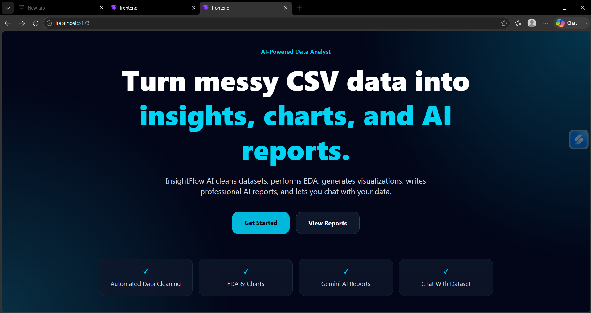
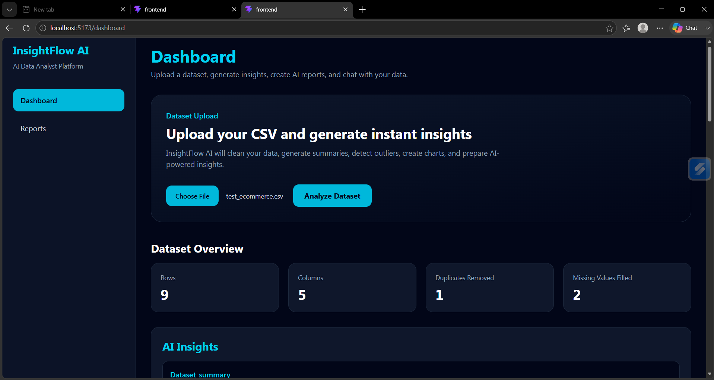
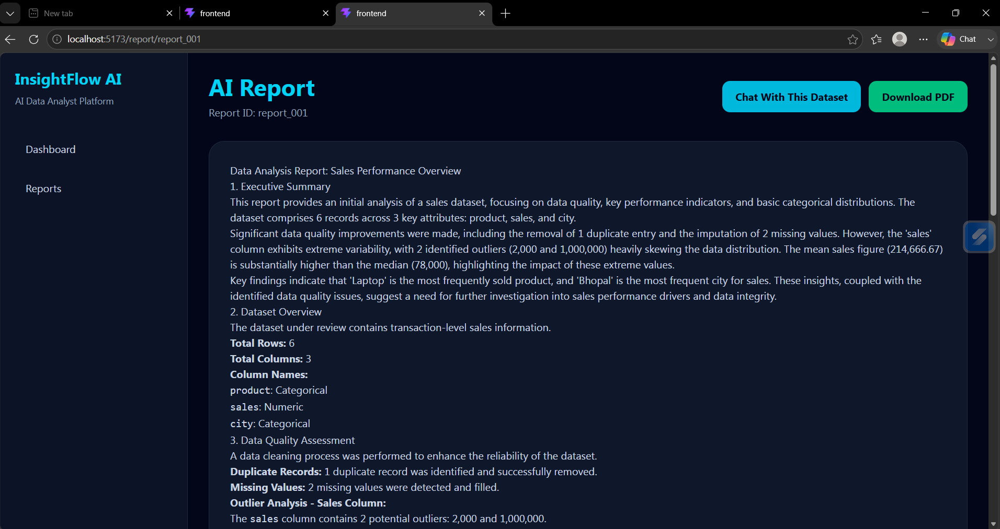
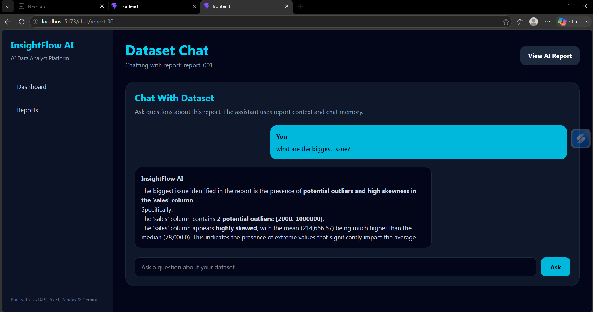
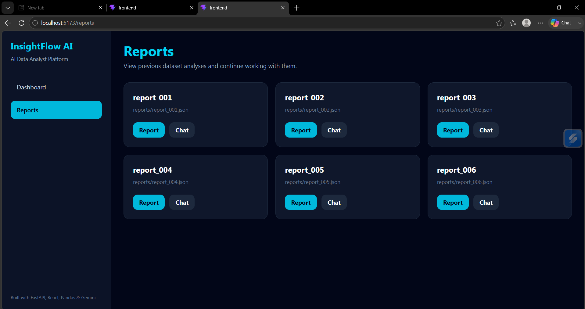

# Analytica AI 

> AI-Powered Automated Data Analyst & Insight Engine

Analytica AI is a full-stack data analysis platform that automates the workflow of a junior data analyst. Users can upload CSV datasets, automatically clean and analyze data, generate visualizations, create AI-powered business reports, and chat with their datasets through a modern web interface.

---

## Features

### Data Processing

* CSV Upload
* Missing Value Handling
* Duplicate Removal
* Outlier Detection (IQR)
* Automated Data Cleaning

### Data Analysis

* Exploratory Data Analysis (EDA)
* Automated Chart Generation
* Statistical Summaries
* Data Visualization

### AI Capabilities

* Gemini AI-Powered Insights
* AI Business Report Generation
* Dataset Question Answering
* AI Report Caching

### Data Persistence

* Report History
* Chat History Persistence
* JSON-Based Storage

### Downloads

* Cleaned Dataset Export
* Outlier-Removed Dataset Export
* PDF Report Export

### Frontend

* React Dashboard
* AI Report Viewer
* Dataset Chat Interface
* Report History Page
* Responsive UI with Tailwind CSS

---

## Screenshots

### Home Page



### Dashboard



### Report Page



### Dataset Chat



### Report History



---

## Tech Stack

### Backend

* Python
* FastAPI
* Pandas
* NumPy
* Matplotlib
* Gemini AI

### Frontend

* React
* Tailwind CSS
* React Router
* Axios

---

## Project Structure

```text
Analytica-AI/
│
├── backend/
│   └── app.py
│
├── frontend/
│
├── src/
│   ├── cleaner.py
│   ├── eda.py
│   ├── gemini_service.py
│   ├── llm.py
│   ├── pdf_generator.py
│   ├── pipeline.py
│   ├── qa.py
│   ├── report_generator.py
│   ├── reporting.py
│   ├── storage.py
│   └── visualizer.py
│
├── assets/
│   └── screenshots/
│
├── data/
├── uploads/
├── reports/
├── charts/
├── cleaned_data/
├── pdf_reports/
│
├── run_pipeline.py
├── requirements.txt
└── README.md
```

---

## Installation

### Prerequisites

- Python 3.10 or newer
- Node.js and npm
- Git (to clone the project)

### 1. Get the project

Clone the repository, then open a terminal in the project folder (the folder containing `requirements.txt`):

```bash
git clone https://github.com/KaleSujit9011/Analytica.AI.git
cd Analytica.AI
```

### 2. Set up the backend

Create a virtual environment so the backend dependencies are kept separate from other Python projects.

**Windows PowerShell:**

```powershell

py -m venv .venv
.\.venv\Scripts\Activate.ps1
python -m pip install --upgrade pip
python -m pip install -r requirements.txt

```

If PowerShell prevents activation, use Command Prompt and run `.\.venv\Scripts\activate.bat`, then run the two `python -m pip` commands above.

**macOS or Linux:**

```bash
python3 -m venv .venv
source .venv/bin/activate
python -m pip install --upgrade pip
python -m pip install -r requirements.txt
```

When the environment is active, your terminal prompt usually shows `(.venv)`.

### 3. Configure Gemini (optional)

Create a `.env` file in the project folder and add your Gemini API key. AI-generated insights and chat need this key; the rest of the app can be started without it.

```env
GEMINI_API_KEY=your_api_key_here
```

### 4. Set up the frontend

Open a terminal in the `frontend` folder and install the JavaScript dependencies:

```bash
cd frontend
npm install
```

### 5. Run the project

Start the backend in one terminal from the project folder. Activate `.venv` first if it is not already active:

```bash
uvicorn backend.app:app --reload
```

The backend API will be available at `http://127.0.0.1:8000` and its interactive documentation at `http://127.0.0.1:8000/docs`.

In a second terminal, start the frontend:

```bash
cd frontend
npm run dev
```

Open the local URL printed by Vite (usually `http://localhost:5173`) in your browser. Keep both terminals running while you use the app.

To stop either server, press `Ctrl+C` in its terminal. To leave the Python virtual environment, run `deactivate`.

---

## Environment Variables

See [Configure Gemini](#3-configure-gemini-optional) above. The `.env` file belongs in the project root and should not be committed.

---

## Live Demo -

Frontend = https://analytica-ai-two.vercel.app

Backend = https://analytica-ai-tit6.onrender.com

---

## Current Version

```text
v1.0.0
```

---

## Future Improvements

* Authentication
* SQLite/PostgreSQL Integration
* Multi-User Architecture

---

## Author

Sujit Kale

Python Developer | FastAPI | React | AI-Powered Applications
